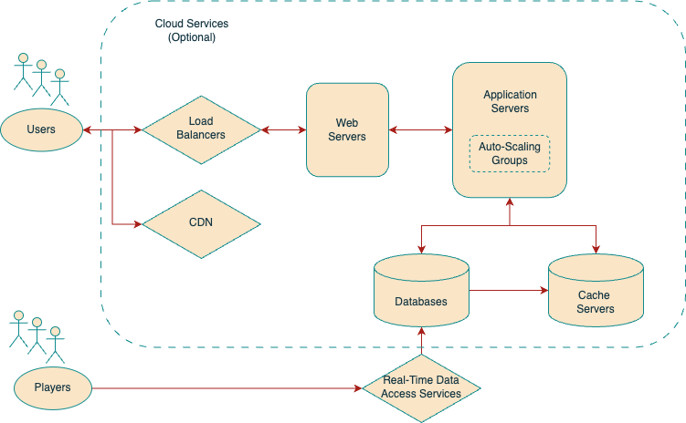

## System Design for Basketball Application

Building a real-time statistics application demands not just a performant backend but also a responsive frontend that can gracefully handle real-time data.

### **1) Technologies Leveraged**

#### **Frontend Technologies**

- React with Redux
  - _Purpose_: React is a JavaScript library for building interactive user interfaces while Redux is used for application state management.
  - _Advantage_: Together, they allow for efficient and modular UI development with predictable state management. Real-time data updates are handled seamlessly, creating a smooth user experience.

#### **Backend Technologies**

- Node.js paired with Express.js
  - _Purpose_: Node.js is a JavaScript runtime built on Chrome's V8 JavaScript engine, and Express.js is a minimal and flexible Node.js web application framework.
  - _Advantage_: Their combination allows for fast backend server development. The non-blocking I/O nature of Node.js ensures efficient real-time data handling.

#### **_Database Selection_**

- MongoDB with Mongoose
  - _Type_: NoSQL (Document-based).
  - _Purpose_: MongoDB is a document database, which means it stores data in BSON format. Mongoose provides a straight-forward, schema-based solution to model application data.
  - _Advantage_: Its flexible schema-less design allows for quick iteration and development. Mongoose aids with schema validation, relationship management, and provides various utilities.

#### **Real-time Communication**

- WebSocket (leveraging Socket.io)
  - _Purpose_: To provide a protocol independent of HTTP, which offers persistent connections for real-time data transfer.
  - _Advantage_: Enables instant data updates between the server and clients without the overhead of constant polling.

#### **Load Balancing**

- Nginx or AWS Elastic Load Balancer
  - _Purpose_: Distribute incoming application traffic across multiple targets, such as EC2 instances, containers, and IP addresses, in one or more Availability Zones.
  - _Advantage_: They ensure that the application remains available even if one or more server instances fail. This ensures consistent performance and user experience.

#### **Content Delivery**

- CDNs – Cloudflare or AWS CloudFront
  - _Purpose_: A content delivery network (CDN) is a system of distributed servers that deliver web content based on the geographic locations of the user and the origin server.
  - _Advantage_: Enhances application speed and resilience by delivering content from the nearest cache, reducing latency, and server load.

#### **Data Caching Solutions**

- Redis or AWS ElastiCache
  - _Purpose_: In-memory data structure store, used as a cache or data store.
  - _Advantage_: They offer high performance and low latency data access, speeding up data retrieval by reducing direct database reads.

#### **Hosting & Scalability**

- AWS EC2 paired with Auto Scaling
  - _Purpose_: AWS EC2 provides scalable compute capacity in the cloud, and Auto Scaling ensures that you have the correct number of EC2 instances available to handle your application's load.
  - _Advantage_: Automatically adjusts resources based on demand, ensuring consistent application responsiveness without manual intervention.

### **2) Challenges at 10,000 Concurrent Users**

#### **Server Overload**

With 10,000 concurrent users, the server might experience strain, especially during real-time updates. This emphasizes the need for horizontal scaling and possibly moving to a more distributed system.

#### **Database Scaling**

The surge in database operations might necessitate strategies like database sharding, partitioning, or introducing read replicas to offload the primary database.

#### **WebSocket Constraints**

Maintaining tens of thousands of open WebSocket connections could lead to delayed updates and necessitate optimizing the real-time data delivery mechanism.
